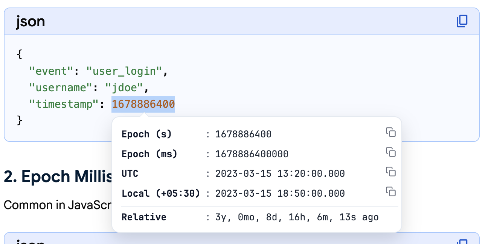
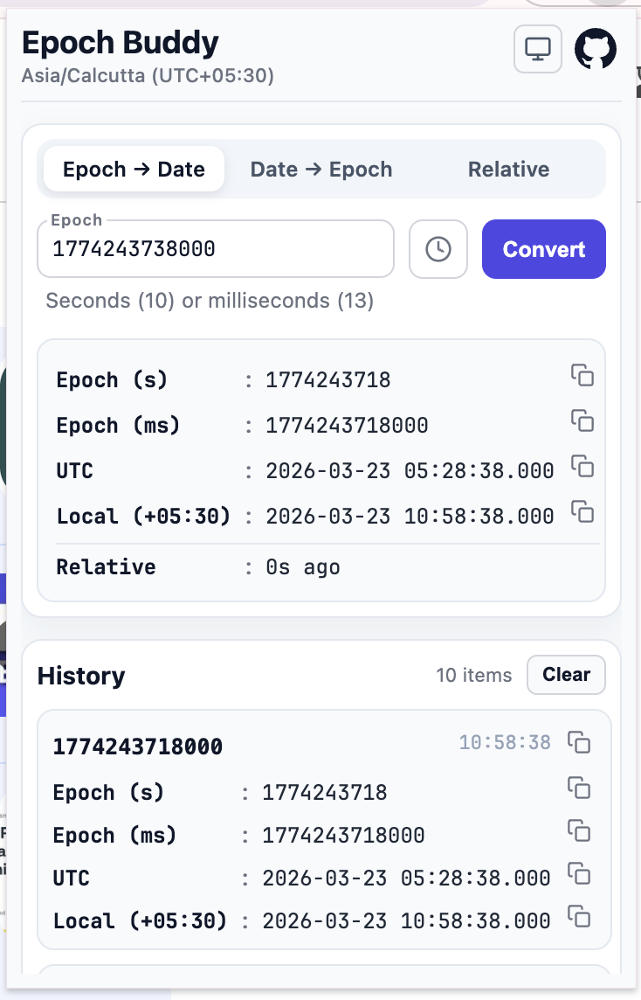
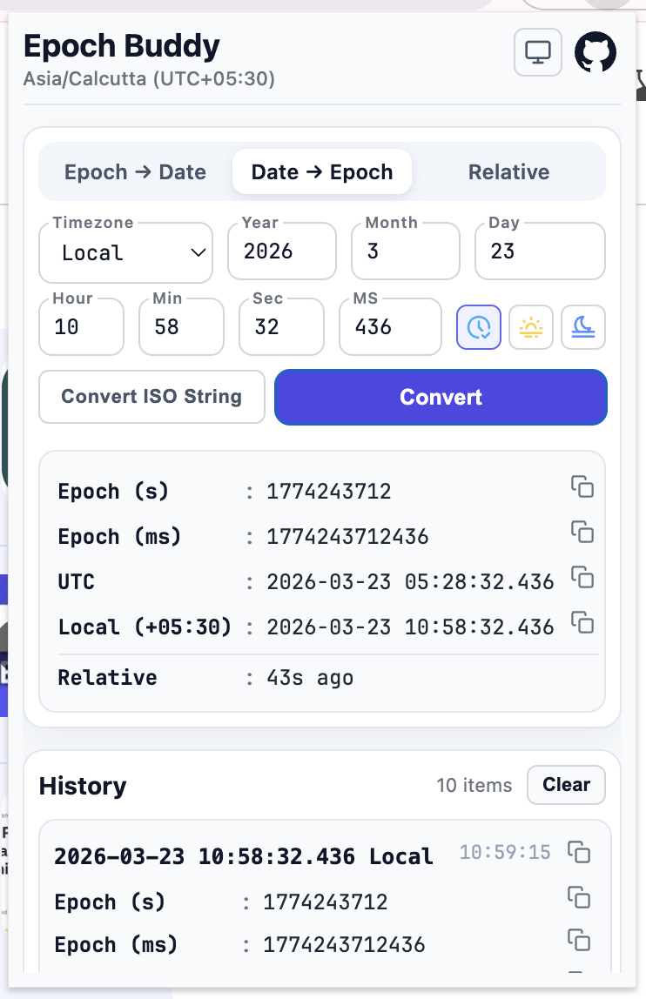
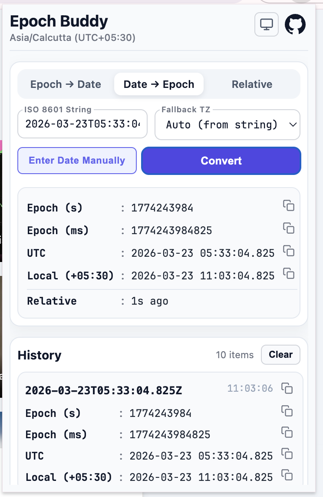
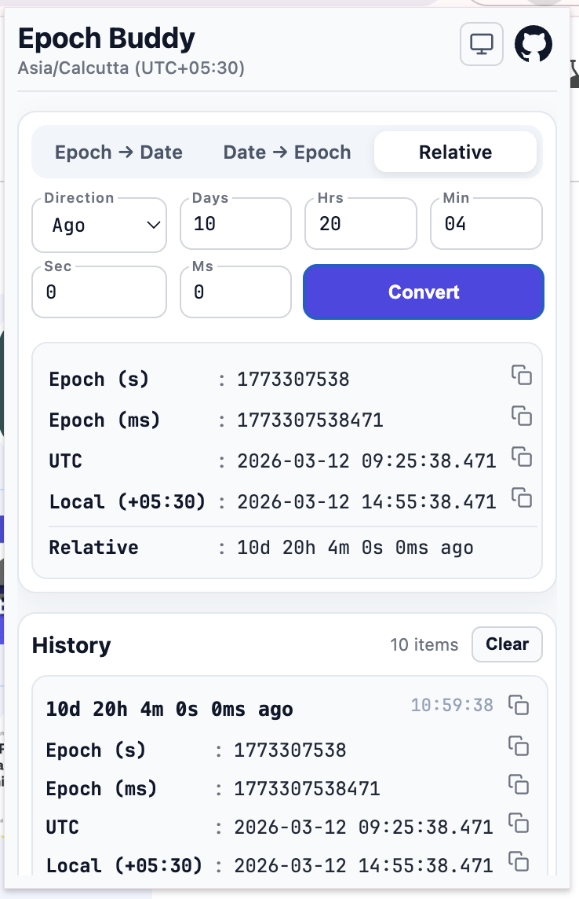
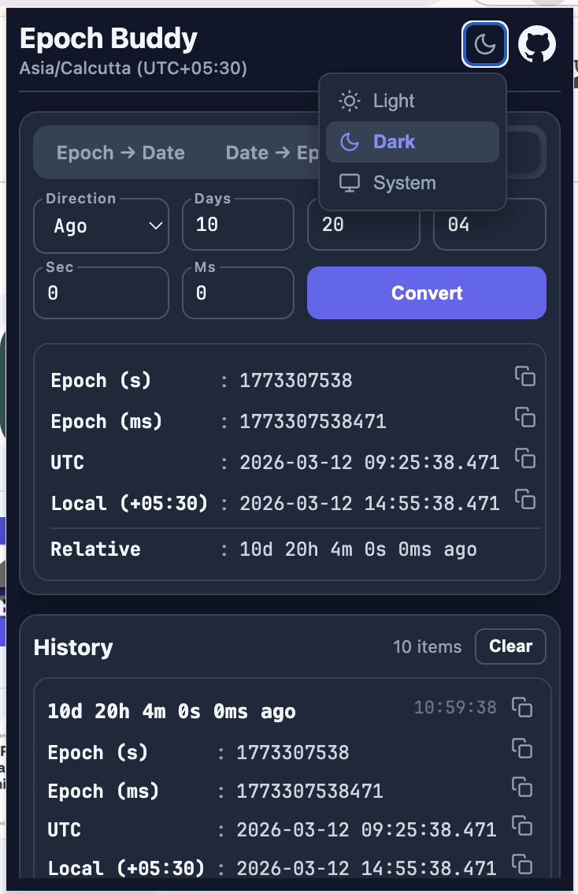
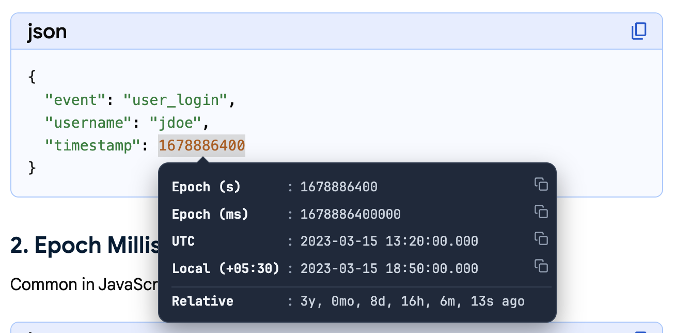

# Epoch Buddy

A browser extension that converts epoch timestamps into human-readable dates (and vice-versa) -- from any web page selection or the extension popup.

## Installation

- [Chrome Web Store](https://chromewebstore.google.com/detail/epoch-buddy/ehjdbcbcfobnkanngnjlibodhgdbhkam?utm_source=github&utm_medium=referral&utm_campaign=epoch_buddy_launch&utm_content=readme)
- [Firefox Add-ons](https://addons.mozilla.org/en-US/firefox/addon/epoch-buddy/?utm_source=github&utm_medium=referral&utm_campaign=epoch_buddy_launch&utm_content=readme)

## Features

- **On-page selection**: Select a 10 or 13 digit epoch on any website to see an inline conversion popup.

  

- **Epoch to Date**: Paste or type an epoch and get UTC, Local, and Relative time. A dedicated clock button copies the current millisecond timestamp to your clipboard and populates the input field.

  

- **Date to Epoch**: Enter date/time using numeric fields with inline validation. Time presets (Now, Start of Day, End of Day) sit alongside the time fields for quick access. Switch to **ISO string mode** to paste an ISO 8601 value (e.g. `2026-03-19T12:00:00.000Z`) with an optional fallback timezone selector.

  

  

- **Relative to Epoch**: Enter a duration (ago / from now) and get Epoch, UTC, Local, and Relative time. Overflow values are automatically normalized on blur (e.g. 90 minutes becomes 1 hour 30 minutes).

  

- **Smart validation**: All numeric fields enforce min/max ranges, show per-field error highlighting, and default to zero on blur for time fields (date fields require a value).
- **History**: Last 10 conversions with quick copy buttons and a clear button.
- **Dark Mode**: Supports dark mode in both the extension menu and the popup.

  

  

- **Timezone display**: The extension popup header shows the current IANA timezone and UTC offset.
- **Feedback (v1.5+)**: Optional footer with a 5-star flow — lower ratings can open your Google Form, higher ratings the Chrome or Firefox store review page (URLs wired at build time). The footer is pinned to the bottom of the popup; you can dismiss it locally until reinstall.

## Quick start

```bash
npm install
npm run build          # one-shot build (default: Chrome/Edge manifest)
```

### Browser-specific builds

The extension uses a single `manifest.json`. The build script patches it for the target browser:

```bash
npm run build              # build JS (manifest unchanged)
npm run build:chrome       # build JS + set manifest for Chrome/Edge
npm run build:firefox      # build JS + set manifest for Firefox

npm run watch              # watch mode (manifest unchanged)
npm run watch:chrome       # watch mode + set manifest for Chrome/Edge
npm run watch:firefox      # watch mode + set manifest for Firefox (restores on exit)
```

### Load in browser (developer mode)

**Chrome / Edge**

1. Run `npm run build` or `npm run build:chrome`
2. Open `chrome://extensions`, enable Developer mode
3. Click **Load unpacked** and select the `extension/` folder

**Firefox**

1. Run `npm run build:firefox`
2. Open `about:debugging#/runtime/this-firefox`
3. Click **Load Temporary Add-on** and select `extension/manifest.json`

### Packaging for store submission

```bash
npm run pack:chrome    # --> dist/chrome.zip
npm run pack:firefox   # --> dist/firefox.zip (manifest patched automatically)
npm run pack           # build both zips
```

Pack commands always produce a clean zip for each browser regardless of the current manifest state.

## Project structure

```bash
src/
  shared/            # Shared utilities (formatting, parsing, clipboard)
  popup/main.js      # Extension popup entry point
  content/main.js    # Content script entry point
  demo/main.js       # GitHub Pages demo entry point
extension/           # Extension package (HTML, CSS, manifest + built JS)
docs/                # GitHub Pages website (HTML, CSS + built demo.js)
scripts/build.mjs    # Build, watch, and packaging script
```

Source code lives in `src/`. The build step bundles each entry point into self-contained IIFE files using [esbuild](https://esbuild.github.io/).

## Development

See [`Developer.md`](Developer.md) for the full development workflow.

## Links

- [Live demo](https://shivams136.github.io/epoch-buddy/demo.html)
- [GitHub](https://github.com/ShivamS136/epoch-buddy)
